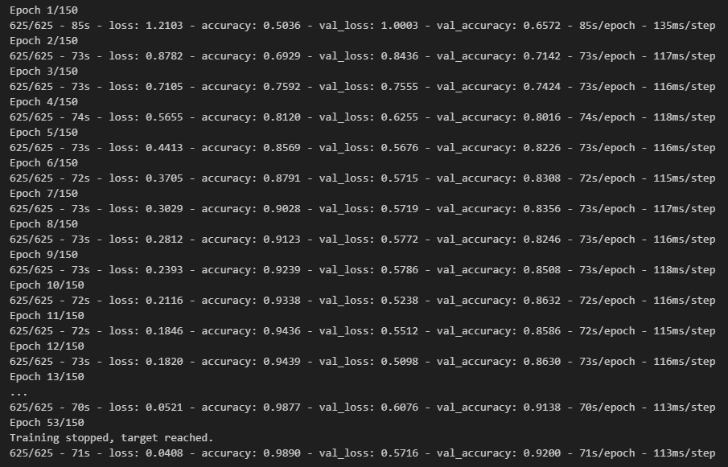

<h1 align="center">
Classification Model on a Bottle Pack
</h1>

Model Menggunakan Model Sequential, Conv2D, Pooling Layer. Model dikonversi ke dalam format berkas TFlite.

<h2 align="center">
Preview Epoch
</h2>

  
  <!--  -->

  <!-- 
   -->

<h2 align="center">
Presented By
</h2>
<h3 align="center">Rafi Rachmad Ramadhan</h3>
 
